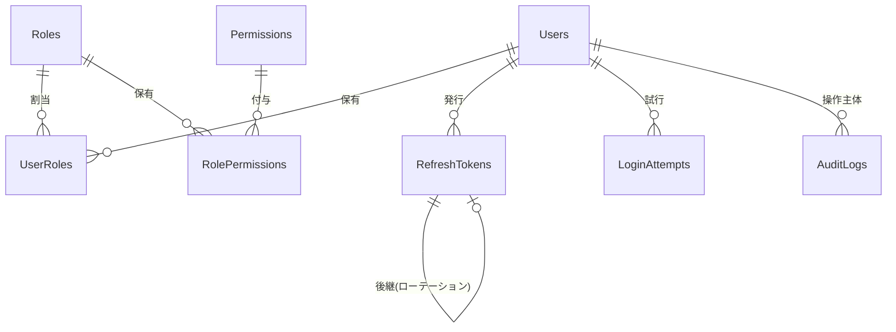

# 認証・認可（ログイン機能）テーブル定義書

業務システム開発プラットフォーム（DevPortal）のログイン機能で使用する、SQL Server 上のテーブル定義をまとめる。

- 対象 DB: **SQL Server**
- 利用側: **C# (.NET 10)** バックエンド（EF Core 想定）
- 認証方式: **自前パスワード認証**（パスワードはハッシュ化して保存）
- 認可: **RBAC**（ロール＋権限の多対多）
- セッション: **リフレッシュトークンを DB で失効管理**（ローテーション／再利用検知あり）
- 付随機能: **ログイン試行履歴＋アカウントロックアウト**、**監査ログ**

---

## 1. 全体方針・共通規約

| 項目 | 方針 |
|------|------|
| スキーマ | すべて `auth` スキーマに配置する |
| テーブル名 | PascalCase・複数形（例: `Users`） |
| 列名 | PascalCase |
| 主キー（外部公開エンティティ） | 内部結合用の `Id BIGINT IDENTITY`（クラスタ化）＋ 外部API公開用の `PublicId UNIQUEIDENTIFIER`。連番IDの推測・件数露見を防ぐ |
| 主キー（マスタ系） | `Roles` / `Permissions` は件数が少なく推測リスクも低いため `Id INT IDENTITY` |
| 日時 | `DATETIME2(3)`・**UTC で保存**・列名は接尾辞 `Utc`・既定値 `SYSUTCDATETIME()` |
| 文字列 | 多言語（日本語）対応のため `NVARCHAR` を使用 |
| 真偽値 | `BIT` |
| 同時実行制御 | 更新があるエンティティは `RowVersion ROWVERSION`（EF Core の楽観的同時実行に対応） |
| IPアドレス | `NVARCHAR(45)`（IPv6 の最大長を考慮） |
| 削除方針 | ユーザーは物理削除せず `IsActive` で無効化（監査ログ・履歴の整合を保つ） |

---

## 2. ER 図



テキスト表現:

```
Users 1───* UserRoles *───1 Roles 1───* RolePermissions *───1 Permissions
Users 1───* RefreshTokens   (ReplacedByTokenId による自己参照のローテーション連鎖)
Users 1───* LoginAttempts   (失敗時は UserId = NULL もあり得る)
Users 1───* AuditLogs        (ActorUserId = 操作主体。システム操作時は NULL)
```

---

## 3. テーブル一覧

| # | テーブル | 役割 |
|---|----------|------|
| 1 | `auth.Users` | ユーザー本体（ログインID・パスワードハッシュ・ロックアウト状態） |
| 2 | `auth.Roles` | ロール（例: 管理者・開発者・閲覧者） |
| 3 | `auth.Permissions` | 権限（例: `user.manage`・`catalog.read`） |
| 4 | `auth.UserRoles` | ユーザー⇔ロール（多対多） |
| 5 | `auth.RolePermissions` | ロール⇔権限（多対多） |
| 6 | `auth.RefreshTokens` | リフレッシュトークン（失効・ローテーション管理） |
| 7 | `auth.LoginAttempts` | ログイン試行履歴（ロックアウト判定の根拠） |
| 8 | `auth.AuditLogs` | 監査ログ（操作履歴全般） |

---

## 4. 各テーブル定義

### 4.1 `auth.Users` — ユーザー

ログインの主体。資格情報（パスワードハッシュ）とロックアウトの現在状態を保持する。

| 列名 | 型 | NULL | キー/制約 | 既定値 | 説明 |
|------|----|------|-----------|--------|------|
| `Id` | BIGINT IDENTITY | NOT NULL | PK | — | 内部主キー（結合・クラスタ化用） |
| `PublicId` | UNIQUEIDENTIFIER | NOT NULL | UQ | `NEWID()` | 外部API公開用の安定ID |
| `UserName` | NVARCHAR(256) | NOT NULL | | — | ログインID（表示用の原文） |
| `NormalizedUserName` | NVARCHAR(256) | NOT NULL | UQ | — | 大文字化した正規化値（大小無視の一意・検索用） |
| `Email` | NVARCHAR(256) | NOT NULL | | — | メールアドレス（原文） |
| `NormalizedEmail` | NVARCHAR(256) | NOT NULL | UQ | — | 大文字化した正規化メール（一意・検索用） |
| `EmailConfirmed` | BIT | NOT NULL | | `0` | メール確認済みフラグ |
| `PasswordHash` | NVARCHAR(MAX) | NOT NULL | | — | アルゴリズム＋salt＋反復回数を内包したハッシュ文字列 |
| `SecurityStamp` | NVARCHAR(64) | NOT NULL | | `NEWID()` | 資格情報変更時に更新し、全トークンを一括無効化するための印 |
| `DisplayName` | NVARCHAR(128) | NULL | | — | 画面表示名 |
| `AccessFailedCount` | INT | NOT NULL | | `0` | 連続ログイン失敗回数（成功でリセット） |
| `LockoutEnabled` | BIT | NOT NULL | | `1` | ロックアウト対象とするか |
| `LockoutEndUtc` | DATETIME2(3) | NULL | | — | ロック解除時刻（NULL=ロックなし） |
| `IsActive` | BIT | NOT NULL | | `1` | 有効フラグ（退職・無効化で `0`） |
| `CreatedAtUtc` | DATETIME2(3) | NOT NULL | | `SYSUTCDATETIME()` | 作成時刻 |
| `UpdatedAtUtc` | DATETIME2(3) | NULL | | — | 最終更新時刻 |
| `RowVersion` | ROWVERSION | NOT NULL | | （自動） | 楽観的同時実行制御用 |

### 4.2 `auth.Roles` — ロール

| 列名 | 型 | NULL | キー/制約 | 既定値 | 説明 |
|------|----|------|-----------|--------|------|
| `Id` | INT IDENTITY | NOT NULL | PK | — | 主キー |
| `Name` | NVARCHAR(128) | NOT NULL | | — | ロール名（原文） |
| `NormalizedName` | NVARCHAR(128) | NOT NULL | UQ | — | 正規化ロール名（一意） |
| `Description` | NVARCHAR(256) | NULL | | — | 説明 |
| `IsSystem` | BIT | NOT NULL | | `0` | 組み込みロール（削除・改名不可）か |
| `CreatedAtUtc` | DATETIME2(3) | NOT NULL | | `SYSUTCDATETIME()` | 作成時刻 |
| `UpdatedAtUtc` | DATETIME2(3) | NULL | | — | 最終更新時刻 |
| `RowVersion` | ROWVERSION | NOT NULL | | （自動） | 楽観的同時実行制御用 |

### 4.3 `auth.Permissions` — 権限

| 列名 | 型 | NULL | キー/制約 | 既定値 | 説明 |
|------|----|------|-----------|--------|------|
| `Id` | INT IDENTITY | NOT NULL | PK | — | 主キー |
| `Code` | NVARCHAR(128) | NOT NULL | UQ | — | 権限コード（例: `user.manage`）。コードで判定する |
| `DisplayName` | NVARCHAR(128) | NOT NULL | | — | 表示名 |
| `Description` | NVARCHAR(256) | NULL | | — | 説明 |
| `Category` | NVARCHAR(64) | NULL | | — | UI でのグルーピング用カテゴリ |
| `CreatedAtUtc` | DATETIME2(3) | NOT NULL | | `SYSUTCDATETIME()` | 作成時刻 |

### 4.4 `auth.UserRoles` — ユーザー⇔ロール（多対多）

| 列名 | 型 | NULL | キー/制約 | 既定値 | 説明 |
|------|----|------|-----------|--------|------|
| `UserId` | BIGINT | NOT NULL | PK / FK→Users.Id | — | ユーザー |
| `RoleId` | INT | NOT NULL | PK / FK→Roles.Id | — | ロール |
| `AssignedAtUtc` | DATETIME2(3) | NOT NULL | | `SYSUTCDATETIME()` | 割当時刻 |
| `AssignedByUserId` | BIGINT | NULL | FK→Users.Id | — | 割当を行った操作者 |

主キーは複合 `(UserId, RoleId)`。

### 4.5 `auth.RolePermissions` — ロール⇔権限（多対多）

| 列名 | 型 | NULL | キー/制約 | 既定値 | 説明 |
|------|----|------|-----------|--------|------|
| `RoleId` | INT | NOT NULL | PK / FK→Roles.Id | — | ロール |
| `PermissionId` | INT | NOT NULL | PK / FK→Permissions.Id | — | 権限 |

主キーは複合 `(RoleId, PermissionId)`。

### 4.6 `auth.RefreshTokens` — リフレッシュトークン

短命なアクセストークン（JWT）を再発行するためのリフレッシュトークンを管理する。**トークン原本は保存せずハッシュで保存**し、ローテーションと再利用検知を行う。

| 列名 | 型 | NULL | キー/制約 | 既定値 | 説明 |
|------|----|------|-----------|--------|------|
| `Id` | BIGINT IDENTITY | NOT NULL | PK | — | 主キー |
| `UserId` | BIGINT | NOT NULL | FK→Users.Id | — | 所有ユーザー |
| `TokenHash` | VARBINARY(32) | NOT NULL | UQ | — | トークンの SHA-256 ハッシュ（原本は保存しない） |
| `JwtId` | UNIQUEIDENTIFIER | NULL | | — | 紐づくアクセストークンの `jti`（任意） |
| `ExpiresAtUtc` | DATETIME2(3) | NOT NULL | | — | 有効期限 |
| `CreatedAtUtc` | DATETIME2(3) | NOT NULL | | `SYSUTCDATETIME()` | 発行時刻 |
| `CreatedByIp` | NVARCHAR(45) | NULL | | — | 発行元IP |
| `DeviceInfo` | NVARCHAR(256) | NULL | | — | 端末・UA 情報（端末別ログアウト用） |
| `RevokedAtUtc` | DATETIME2(3) | NULL | | — | 失効時刻（NULL=有効） |
| `RevokedByIp` | NVARCHAR(45) | NULL | | — | 失効操作元IP |
| `RevokedReason` | NVARCHAR(32) | NULL | | — | 失効理由（区分値は §7 参照） |
| `ReplacedByTokenId` | BIGINT | NULL | FK→RefreshTokens.Id | — | ローテーション後継トークン（自己参照） |

### 4.7 `auth.LoginAttempts` — ログイン試行履歴

成功・失敗を問わずログイン試行を記録する。ロックアウト判定と不正アクセス検知の根拠。書き込み量が多いため、保持期間を定めた定期削除を想定する。

| 列名 | 型 | NULL | キー/制約 | 既定値 | 説明 |
|------|----|------|-----------|--------|------|
| `Id` | BIGINT IDENTITY | NOT NULL | PK | — | 主キー |
| `UserId` | BIGINT | NULL | FK→Users.Id | — | 該当ユーザー（不在時は NULL） |
| `AttemptedUserName` | NVARCHAR(256) | NOT NULL | | — | 入力されたログインID |
| `Succeeded` | BIT | NOT NULL | | — | 成功したか |
| `FailureReason` | NVARCHAR(32) | NULL | | — | 失敗理由（成功時は NULL。区分値は §7 参照） |
| `IpAddress` | NVARCHAR(45) | NULL | | — | 接続元IP |
| `UserAgent` | NVARCHAR(512) | NULL | | — | UA 文字列 |
| `AttemptedAtUtc` | DATETIME2(3) | NOT NULL | | `SYSUTCDATETIME()` | 試行時刻 |

制約: `Succeeded = 1` のとき `FailureReason` は NULL であること（CHECK 制約）。

### 4.8 `auth.AuditLogs` — 監査ログ

ログイン成功/失敗・権限変更など、セキュリティ上重要な操作履歴を長期保存する。

| 列名 | 型 | NULL | キー/制約 | 既定値 | 説明 |
|------|----|------|-----------|--------|------|
| `Id` | BIGINT IDENTITY | NOT NULL | PK | — | 主キー |
| `ActorUserId` | BIGINT | NULL | FK→Users.Id | — | 操作主体（システム操作時は NULL） |
| `EventType` | NVARCHAR(64) | NOT NULL | | — | イベント種別（区分値は §7 参照） |
| `TargetType` | NVARCHAR(64) | NULL | | — | 操作対象の種別（User / Role / Permission 等） |
| `TargetId` | NVARCHAR(64) | NULL | | — | 操作対象のID（種別非依存で汎用化するため文字列） |
| `Detail` | NVARCHAR(MAX) | NULL | | — | 詳細（JSON。変更前後の差分など） |
| `IpAddress` | NVARCHAR(45) | NULL | | — | 接続元IP |
| `UserAgent` | NVARCHAR(512) | NULL | | — | UA 文字列 |
| `CorrelationId` | UNIQUEIDENTIFIER | NULL | | — | リクエスト相関ID（トレース連携用） |
| `CreatedAtUtc` | DATETIME2(3) | NOT NULL | | `SYSUTCDATETIME()` | 記録時刻 |

---

## 5. インデックス一覧

| テーブル | インデックス | 種別 | 目的 |
|----------|--------------|------|------|
| `Users` | `NormalizedUserName` | UNIQUE | ログインID の一意・検索 |
| `Users` | `NormalizedEmail` | UNIQUE | メールの一意・検索 |
| `Users` | `PublicId` | UNIQUE | 外部公開ID の検索 |
| `Roles` | `NormalizedName` | UNIQUE | ロール名の一意 |
| `Permissions` | `Code` | UNIQUE | 権限コードの一意 |
| `RefreshTokens` | `TokenHash` | UNIQUE | トークン照合 |
| `RefreshTokens` | `UserId` | 非クラスタ | ユーザー単位の列挙・失効 |
| `RefreshTokens` | `ExpiresAtUtc` | 非クラスタ | 期限切れトークンの一括削除 |
| `LoginAttempts` | `(AttemptedUserName, AttemptedAtUtc)` | 非クラスタ | ロックアウト判定 |
| `LoginAttempts` | `(IpAddress, AttemptedAtUtc)` | 非クラスタ | IP 単位の不正検知 |
| `AuditLogs` | `(ActorUserId, CreatedAtUtc)` | 非クラスタ | 操作者別の追跡 |
| `AuditLogs` | `(EventType, CreatedAtUtc)` | 非クラスタ | 種別別の追跡 |
| `AuditLogs` | `(TargetType, TargetId)` | 非クラスタ | 対象別の追跡 |

---

## 6. 外部キーと削除時の挙動

SQL Server の「複数カスケード経路」エラーを避けるため、外部キーは原則 **`ON DELETE NO ACTION`**（カスケードしない）とし、関連の解除はアプリケーション側で行う。ユーザーは物理削除せず `IsActive = 0` で無効化する運用を前提とする。

| 子テーブル | 親 | 削除時 |
|------------|----|--------|
| `UserRoles` | `Users` / `Roles` | NO ACTION（アプリで解除） |
| `RolePermissions` | `Roles` / `Permissions` | NO ACTION（アプリで解除） |
| `RefreshTokens` | `Users` | NO ACTION |
| `LoginAttempts` | `Users` | NO ACTION |
| `AuditLogs` | `Users` | NO ACTION（監査記録は保持） |

---

## 7. 区分値（アプリケーション管理）

文字列で保持し、値の管理はアプリケーション側で行う（必要に応じて CHECK 制約や参照テーブル化も可能）。

**`RefreshTokens.RevokedReason`**

| 値 | 意味 |
|----|------|
| `Logout` | 利用者による明示的ログアウト |
| `Rotated` | ローテーションによる正常な置き換え |
| `ReuseDetected` | 失効済みトークンの再利用を検知 |
| `PasswordChanged` | パスワード変更に伴う一括失効 |
| `AdminRevoked` | 管理者による強制失効 |

**`LoginAttempts.FailureReason`**

| 値 | 意味 |
|----|------|
| `BadPassword` | パスワード不一致 |
| `UserNotFound` | ユーザーが存在しない |
| `LockedOut` | ロックアウト中 |
| `Disabled` | アカウント無効 |
| `EmailNotConfirmed` | メール未確認 |

**`AuditLogs.EventType`（代表例）**

`LoginSucceeded` / `LoginFailed` / `Logout` / `PasswordChanged` / `UserCreated` / `UserDisabled` / `RoleAssigned` / `RoleRemoved` / `RoleCreated` / `PermissionGranted` / `TokenRevoked`

---

## 8. 設計メモ・今後の拡張

- **個別権限**: 現状はロール経由でのみ権限を持つ純粋な RBAC。ユーザー個別の例外権限が必要になれば `auth.UserPermissions`（`UserId`・`PermissionId`・許可/拒否フラグ）を追加して拡張できる。
- **外部IdP 連携**: 将来 Entra ID / OIDC を併用する場合は `auth.ExternalLogins`（`UserId`・`Provider`・`ProviderKey`）を追加し、`Users.PasswordHash` を NULL 許容にすればよい。
- **MFA**: 二要素認証を導入する場合は `auth.UserMfa`（TOTP シークレット等）と回復コード用テーブルを追加する。
- **パスワード履歴**: 再利用禁止が要件になれば `auth.PasswordHistory` を追加する。
- **セッション概念**: 「アクティブなセッション一覧」を画面提供する場合、`RefreshTokens` を束ねる親 `auth.UserSessions`（端末単位）を設ける案がある。
