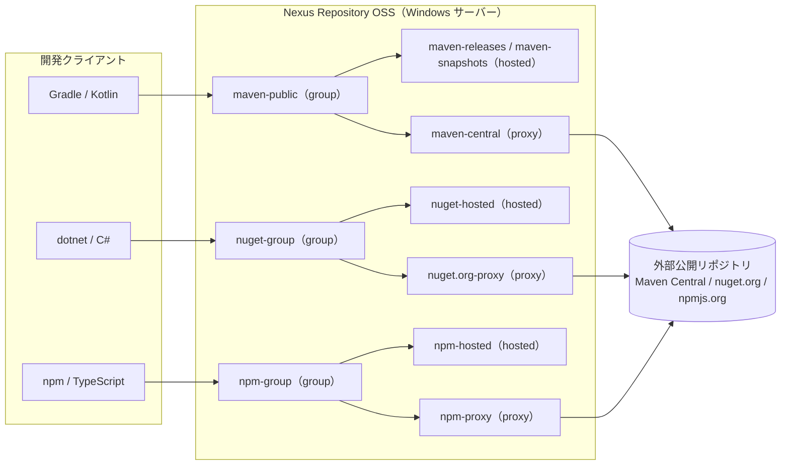

# プライベートレジストリ セットアップ手順書

DevPortal の共有パッケージ（`packages/kotlin` / `packages/csharp` / `packages/typescript`）を、社内限定で配布・取得するためのプライベートレジストリを構築する手順をまとめる。

- 製品: **Sonatype Nexus Repository OSS 3**（無料・セルフホスト）
- 稼働環境: **Windows サーバーに直接インストール**（Windows サービスとして常駐）
- 対象フォーマット: **Maven**（Kotlin / Gradle）・**NuGet**（C# / .NET）・**npm**（TypeScript）を 1 台に統合
- 想定利用者: DevPortal の各チーム（パッケージの公開者・利用者の両方）

> 1 台の Nexus で 3 言語すべてを「自社 hosted（公開先）＋外部 proxy（キャッシュ）＋group（取得用の束ね）」の構成で提供する。利用者は group の URL を 1 つ向けるだけで、自社パッケージと外部 OSS の両方を取得できる。

---

## 1. 決定サマリ

| # | 項目 | 決定 |
| --- | --- | --- |
| 1 | 製品 | **Sonatype Nexus Repository OSS 3**（OSS 版・無料） |
| 2 | 稼働形態 | **Windows サーバーに直接インストール**し、**Windows サービス**として常駐 |
| 3 | 統合方針 | **1 台で 3 フォーマット**（Maven / NuGet / npm）を提供 |
| 4 | リポジトリ構成 | フォーマットごとに **hosted（自社）＋ proxy（外部）＋ group（取得口）** の 3 種を用意 |
| 5 | データベース | **組込み H2**（既定）。将来の冗長化・大規模化時に外部 PostgreSQL へ移行可 |
| 6 | Java | **Java 21**。**Nexus 3.87.0 以降の Windows 配布物は Java 21 を同梱**するため別途インストール不要 |
| 7 | 通信 | 初期は HTTP（`:8081`）でも可。ただし**本番はリバースプロキシで HTTPS 化必須**（認証情報が平文で流れるため） |
| 8 | 認証 | **匿名アクセスは無効化**。取得用ロールと公開用ロールを分離して付与 |

---

## 2. 全体構成



- **hosted**: 自社で作ったパッケージを **公開（push）** する先。
- **proxy**: Maven Central / nuget.org / npmjs.org など外部公開リポジトリを **キャッシュ**する先。
- **group**: hosted と proxy を **1 つの URL に束ねた取得口**。利用者（取得側）はこの group を向ける。

---

## 3. 事前準備（サーバー要件）

| 項目 | 要件・推奨 |
| --- | --- |
| OS | Windows Server（x86-64 / 64bit）。**インストールパスにスペースを含めない**（例: `C:\nexus`）。インストーラがスペース入りパスを扱えないため |
| CPU | x86-64（64bit Intel/AMD） |
| メモリ | 最低 4GB 以上。**Nexus には搭載 RAM の最大 2/3 まで**を割り当て、残り 1/3 は OS に残す |
| ディスク | **常時 4GB 以上の空きを確保**（空きが 4GB を下回ると H2 が読み取り専用モードに切り替わる）。アーティファクト蓄積分も見込んで余裕を持つ |
| Java | **Java 21**。3.87.0 以降の Windows 配布物は同梱のため、通常は別途インストール不要 |
| ポート | 既定 **8081**（Web UI / API 共通）。ファイアウォールで社内からの到達を許可する |
| ウイルススキャナ | **Nexus のインストールフォルダとデータフォルダを除外**する。除外しないと Windows での起動が最大 10 倍遅くなる事例がある |

> サーバーの固定ホスト名（例: `nexus.example.local`）を用意しておくと、後述のクライアント設定や HTTPS 化が容易になる。本書では `<NEXUS_HOST>` と表記する。

---

## 4. Nexus のインストール（展開と基本設定）

### 4.1 ダウンロードと展開

1. 公式のダウンロードページから Windows 用 zip を取得する（執筆時点の最新は **3.92.3**、ファイル名は `nexus-3.92.3-01-win-x86_64.zip`）。
2. スペースを含まないパス（例: `C:\nexus`）へ展開する。展開すると **2 つのフォルダ**が並ぶ。

```text
C:\nexus\
├── nexus-3.92.3-01\        ← アプリ本体（bin / etc / system …）
└── sonatype-work\
    └── nexus3\             ← データ（設定・ブロブ・ログ・admin.password）
```

- `nexus-3.92.3-01\` … プログラム本体。**バージョンアップ時に置き換える**側。
- `sonatype-work\nexus3\` … 保存データ。**バックアップ対象**であり、バージョンアップ後も引き継ぐ側。

### 4.2 待ち受けポートの設定（任意）

```properties
# ファイル: C:\nexus\nexus-3.92.3-01\etc\nexus.properties
# Web UI / API の待ち受けポート（既定 8081。変更する場合のみ記載）
application-port=8081
# 待ち受けアドレス（全 NIC で受ける場合。社内限定なら内向き IP に絞ってもよい）
application-host=0.0.0.0
```

### 4.3 メモリ（JVM）の設定（任意）

```text
# ファイル: C:\nexus\nexus-3.92.3-01\bin\nexus.vmoptions
# 初期ヒープ（搭載 RAM に合わせて調整。既定は 2703m）
-Xms2703m
# 最大ヒープ（搭載 RAM の最大 2/3 を目安に。例: 16GB 機なら 10g 程度まで）
-Xmx2703m
# ダイレクトメモリ
-XX:MaxDirectMemorySize=2703m
```

> ⚠️ **重要**: 後述の手順で Windows サービスとして登録すると、**`nexus.vmoptions` の変更はサービスに反映されなくなる**。メモリ設定を変えたいときは、先にこのファイルを編集してから、サービスを再インストール（アンインストール → 再インストール）する。

---

## 5. Windows サービスとして起動する

### 5.1 動作確認（フォアグラウンド起動）

サービス化の前に、まず単体で起動して問題がないか確認する。

```powershell
# 管理者権限の PowerShell で、本体の bin フォルダへ移動する
Set-Location C:\nexus\nexus-3.92.3-01\bin
# フォアグラウンドで起動する（ログがそのまま流れる。Ctrl+C で停止）
.\nexus.exe /run
```

- 起動後、ブラウザで `http://<NEXUS_HOST>:8081` を開けることを確認する。
- 確認できたら `Ctrl+C` で一旦停止し、サービス登録へ進む。

### 5.2 サービスとして登録・起動

```powershell
# 管理者権限の PowerShell で bin フォルダにいることを確認する
Set-Location C:\nexus\nexus-3.92.3-01\bin
# 同梱のバッチでサービスを登録する（サービス名は SonatypeNexusRepository）
.\install-nexus-service.bat
# サービスを起動する
Start-Service SonatypeNexusRepository
# 自動起動（OS 起動時に開始）に設定する
Set-Service  SonatypeNexusRepository -StartupType Automatic
# 状態を確認する
Get-Service  SonatypeNexusRepository
```

> `install-nexus-service.bat` が無い旧構成の場合は、`nexus.exe /install SonatypeNexusRepository` で登録できる。

### 5.3 サービスの操作（参考）

```powershell
# 起動
.\nexus.exe //ES//SonatypeNexusRepository
# 停止
.\nexus.exe //SS//SonatypeNexusRepository
# サービス登録の解除（設定変更で入れ直す場合など）
.\nexus.exe //DS//SonatypeNexusRepository
```

---

## 6. 初期セットアップ（管理者ログインと最低限のセキュリティ）

1. ブラウザで `http://<NEXUS_HOST>:8081` を開き、右上の **Sign in** を押す。
2. ユーザー名 `admin`、初期パスワードは下記ファイルに記載されている文字列を使う。

```text
# 初期管理者パスワードが書かれたファイル（初回ログイン後に無効化される）
C:\nexus\sonatype-work\nexus3\admin.password
```

3. セットアップウィザードに従って **admin のパスワードを変更**する。
4. ウィザードの **匿名アクセス（Anonymous access）** は **Disable（無効）** を選ぶ。
   - 社内限定配布のため、認証なしの取得は許可しない。
5. 続けて以下を設定する（後からでも可）。

```text
# 管理画面: Administration（歯車アイコン）→ Security → Realms
# クライアント認証を有効化するため、以下の Realm を「Active」へ移動する
- nuget API-Key Realm      … dotnet nuget push（API キー）で必要
- npm Bearer Token Realm   … npm login / npm publish（トークン）で必要
# （Maven は Basic 認証で動くため既定の構成で可）
```

---

## 7. リポジトリ構成

Nexus の新規インストールでは **Maven 系（`maven-central` / `maven-releases` / `maven-snapshots` / `maven-public`）** と **NuGet 系（`nuget.org-proxy` / `nuget-hosted` / `nuget-group`）** が既定で作成されていることが多い。**npm 系は手動作成**が必要。以下は「無ければ作る」前提で記載する。

作成は **Administration → Repository → Repositories → Create repository** から行う。Blob store は初期は既定の `default` を使う（必要になればフォーマット別に分離する）。

### 7.1 Maven（Kotlin / Gradle 用）

| リポジトリ | 種別 | 設定の要点 |
| --- | --- | --- |
| `maven-central` | maven2 (proxy) | Remote storage: `https://repo1.maven.org/maven2/` |
| `maven-releases` | maven2 (hosted) | Version policy: **Release**、Deployment policy: **Disable redeploy** |
| `maven-snapshots` | maven2 (hosted) | Version policy: **Snapshot**、Deployment policy: **Allow redeploy** |
| `maven-public` | maven2 (group) | Members: `maven-releases` → `maven-snapshots` → `maven-central`（この順で並べる） |

- **取得（依存解決）**は `maven-public` を向ける。
- **公開（push）**はリリース版を `maven-releases`、開発版（`-SNAPSHOT`）を `maven-snapshots` へ。

### 7.2 NuGet（C# / .NET 用）

| リポジトリ | 種別 | 設定の要点 |
| --- | --- | --- |
| `nuget.org-proxy` | nuget (proxy) | Remote storage: `https://api.nuget.org/v3/index.json`、Protocol version: **V3** |
| `nuget-hosted` | nuget (hosted) | 自社パッケージの公開先 |
| `nuget-group` | nuget (group) | Members: `nuget-hosted` → `nuget.org-proxy` |

- **取得（restore）**は `nuget-group` の **V3 エンドポイント**（`.../index.json`）を向ける。
- **公開（push）**は `nuget-hosted` へ。

### 7.3 npm（TypeScript 用）

| リポジトリ | 種別 | 設定の要点 |
| --- | --- | --- |
| `npm-proxy` | npm (proxy) | Remote storage: `https://registry.npmjs.org` |
| `npm-hosted` | npm (hosted) | 自社パッケージの公開先 |
| `npm-group` | npm (group) | Members: `npm-hosted` → `npm-proxy` |

- **取得（install）**は `npm-group` を向ける。
- **公開（publish）**は `npm-hosted` へ。
- 自社パッケージは **スコープ付き**（例: `@devportal/...`）にし、スコープだけ社内 group に向けると外部パッケージと混ざらず管理しやすい。

---

## 8. ユーザーとロールの設計

最小権限の原則で、**取得専用**と**公開可能**を分けて付与する。

```text
# 管理画面: Administration → Security → Roles / Users
# ロール例
- devportal-reader   … 各 group からの取得（read）のみ
                        権限例: nx-repository-view-*-*-read / browse
- devportal-publisher … 上記 read に加え、各 hosted への公開（add / edit）
                        権限例: nx-repository-view-maven2-maven-releases-add ほか
# ユーザー例
- ci-publish         … CI/CD が公開に使うサービスアカウント（devportal-publisher）
- dev-read           … 各開発者の取得用（devportal-reader）。実運用では個人ユーザーを LDAP 連携等で発行
```

> CI/CD から公開する場合は、人間アカウントではなく **専用のサービスアカウント（例: `ci-publish`）** を作り、公開権限を限定して付与する。

---

## 9. クライアント設定 — Kotlin（Gradle / Maven）

DevPortal は Gradle マルチプロジェクト（`settings.gradle.kts` / `gradle/libs.versions.toml`）で構成されている。以下を追記して、Nexus からの取得・Nexus への公開を行う。

### 9.1 認証情報（共通・コミットしない）

```properties
# ファイル: %USERPROFILE%\.gradle\gradle.properties（ユーザー単位・リポジトリには含めない）
# Nexus のユーザー名
nexusUsername=dev-read
# Nexus のパスワード（または発行したトークン）
nexusPassword=********
```

### 9.2 取得（依存解決）の設定

```kotlin
// ファイル: settings.gradle.kts
// 依存ライブラリの解決方法を設定する
dependencyResolutionManagement {
    // ライブラリを取得するリポジトリ
    repositories {
        // 社内 Nexus の Maven group（自社 hosted ＋ 外部 proxy を束ねた取得口）
        maven {
            // 取得口は maven-public を向ける
            url = uri("http://<NEXUS_HOST>:8081/repository/maven-public/")
            // HTTP の間だけ許可（HTTPS 化後は削除する）
            isAllowInsecureProtocol = true
            // gradle.properties の資格情報を渡す
            credentials {
                username = providers.gradleProperty("nexusUsername").orNull
                password = providers.gradleProperty("nexusPassword").orNull
            }
        }
        // 既存の取得元（Nexus 障害時のフォールバックや移行期に併用可。完全閉域化する場合は削除）
        google()
        mavenCentral()
    }
}
```

### 9.3 公開（publish）の設定

```kotlin
// 公開したいモジュール（例: packages/kotlin/config/core）の build.gradle.kts に追記する
plugins {
    // 既存のプラグインに加えて、Maven 形式での公開機能を有効化する
    `maven-publish`
}

// 成果物の座標（group:artifact:version の group と version）
group = "com.devportal"
// リリース版は "0.1.0"、開発版は "0.1.0-SNAPSHOT" のように付ける
version = "0.1.0-SNAPSHOT"

// 公開先（Nexus の hosted）を定義する
publishing {
    repositories {
        maven {
            // バージョンが SNAPSHOT かどうかで公開先 URL を切り替える
            val snapshots = uri("http://<NEXUS_HOST>:8081/repository/maven-snapshots/")
            val releases  = uri("http://<NEXUS_HOST>:8081/repository/maven-releases/")
            url = if (version.toString().endsWith("SNAPSHOT")) snapshots else releases
            // HTTP の間だけ許可（HTTPS 化後は削除する）
            isAllowInsecureProtocol = true
            // 公開には publisher 権限を持つ資格情報を使う
            credentials {
                username = providers.gradleProperty("nexusUsername").orNull
                password = providers.gradleProperty("nexusPassword").orNull
            }
        }
    }
    // Kotlin Multiplatform に `maven-publish` を適用すると、各ターゲットの publication は自動生成される
}
```

```powershell
# 公開コマンド（対象モジュールを指定して publish する）
.\gradlew :packages:kotlin:config:core:publish
```

---

## 10. クライアント設定 — C#（NuGet / .NET）

### 10.1 取得（restore）の設定

```xml
<!-- ファイル: リポジトリルートまたはソリューション直下の nuget.config -->
<?xml version="1.0" encoding="utf-8"?>
<configuration>
  <!-- 取得元（パッケージソース） -->
  <packageSources>
    <!-- 既定の nuget.org を一旦クリアし、社内 group に集約する（proxy 経由で外部も取得できる） -->
    <clear />
    <!-- 社内 Nexus の NuGet group（V3 エンドポイント = .../index.json） -->
    <add key="nexus" value="http://<NEXUS_HOST>:8081/repository/nuget-group/index.json" />
  </packageSources>
  <!-- 取得元ごとの資格情報（CI ではプレーンテキストを避け、環境変数や暗号化を使う） -->
  <packageSourceCredentials>
    <nexus>
      <!-- Nexus のユーザー名 -->
      <add key="Username" value="dev-read" />
      <!-- Nexus のパスワード（平文。CI 等では ClearTextPassword を避け暗号化する） -->
      <add key="ClearTextPassword" value="********" />
    </nexus>
  </packageSourceCredentials>
</configuration>
```

### 10.2 公開（push）の設定

NuGet の公開には API キーが要る。Nexus 右上のユーザー → **NuGet API Key** で取得する（§6 で `nuget API-Key Realm` を有効化済みであること）。

```powershell
# パッケージを作成する（Release 構成）
dotnet pack -c Release
# 作成した .nupkg を社内 hosted へ公開する（--api-key は Nexus で取得した NuGet API Key）
dotnet nuget push .\bin\Release\*.nupkg `
  --source http://<NEXUS_HOST>:8081/repository/nuget-hosted/ `
  --api-key <NEXUS_NUGET_API_KEY>
```

---

## 11. クライアント設定 — TypeScript（npm）

### 11.1 取得（install）の設定

```ini
# ファイル: リポジトリルートの .npmrc（資格情報を含む行はコミットしない／環境変数化する）
# 既定のレジストリを社内 group に向ける（proxy 経由で外部パッケージも取得できる）
registry=http://<NEXUS_HOST>:8081/repository/npm-group/
# スコープ @devportal は自社 hosted を優先的に解決させる（任意・推奨）
@devportal:registry=http://<NEXUS_HOST>:8081/repository/npm-group/
# 認証トークン（npm login で発行される。host:port とパスを一致させる）
//<NEXUS_HOST>:8081/repository/npm-group/:_authToken=NpmToken.********
```

```powershell
# トークンは npm login で対話的に発行できる（§6 で npm Bearer Token Realm を有効化済みであること）
npm login --registry http://<NEXUS_HOST>:8081/repository/npm-group/
```

### 11.2 公開（publish）の設定

```json
// 公開したいパッケージの package.json に追記する
{
  // 自社スコープを付ける（外部パッケージと衝突させない）
  "name": "@devportal/your-package",
  // 公開先を社内 hosted に固定する
  "publishConfig": {
    "registry": "http://<NEXUS_HOST>:8081/repository/npm-hosted/"
  }
}
```

```powershell
# hosted への公開トークンを発行（未取得の場合）
npm login --registry http://<NEXUS_HOST>:8081/repository/npm-hosted/
# パッケージを公開する（publishConfig があれば --registry は省略可）
npm publish
```

---

## 12. HTTPS 化（本番運用の前提）

HTTP のままでは、Basic 認証や npm/NuGet のトークンが**平文でネットワークを流れる**。社内であっても本番運用では HTTPS を必須とする。

- **推奨**: Nexus の前段に **リバースプロキシ（IIS の ARR、nginx 等）を置いて TLS を終端**し、`https://<NEXUS_HOST>/` で受ける。Nexus 自体は `localhost:8081` のままにする。
- リバースプロキシでは以下に注意する。
  - `X-Forwarded-Proto` / `X-Forwarded-For` を転送し、Nexus 側で **Base URL** を `https://<NEXUS_HOST>` に設定する。
  - npm/NuGet は大きなアーティファクトを扱うため、**アップロードサイズ上限を十分に緩める**。
- HTTPS 化が完了したら、各クライアント設定の URL を `https://<NEXUS_HOST>/` に変更し、Gradle の `isAllowInsecureProtocol = true` を**削除**する。

---

## 13. バックアップ・運用

| 項目 | 方針 |
| --- | --- |
| バックアップ対象 | `C:\nexus\sonatype-work\nexus3`（設定・Blob・DB）。本体フォルダは再展開で復元できるため対象外でよい |
| バックアップ方法 | H2 利用時は **Administration → System → Tasks** の「Export databases for backup」タスク ＋ Blob のファイルコピーを定期実行 |
| クリーンアップ | 不要な SNAPSHOT や未使用キャッシュを **Cleanup Policies ＋ Compact blob store タスク**で定期削除し、ディスクを保全（4GB 割れで読み取り専用になるため） |
| 監視 | ディスク空き容量・サービス稼働・ログ（`sonatype-work\nexus3\log\nexus.log`）を監視 |
| バージョンアップ | 本体フォルダを新バージョンに差し替え、`sonatype-work` は引き継ぐ。サービスは入れ直す（`nexus.vmoptions` 変更時も同様） |
| 将来の冗長化 | 可用性・性能が要件になれば、H2 から **外部 PostgreSQL** へ移行する |

---

## 14. 動作確認チェックリスト

- [ ] `http://<NEXUS_HOST>:8081` にアクセスでき、admin でログインできる。
- [ ] 匿名アクセスが無効、必要な Realm（nuget API-Key / npm Bearer Token）が有効になっている。
- [ ] Maven: `maven-public` から依存解決でき、`maven-snapshots` へ `publish` できる。
- [ ] NuGet: `nuget-group` から restore でき、`nuget-hosted` へ `dotnet nuget push` できる。
- [ ] npm: `npm-group` から install でき、`npm-hosted` へ `npm publish` できる。
- [ ] 取得専用ユーザーでは公開（push/publish）が拒否される（権限分離の確認）。
- [ ] サービスが自動起動に設定され、サーバー再起動後も復帰する。

---

## 15. 未決事項 / 次のアクション

- [ ] `<NEXUS_HOST>` の正式なホスト名と、HTTPS 用証明書（社内 CA / 公開 CA）を確定する。
- [ ] LDAP / Entra ID 連携でユーザー管理を一元化するか決める（現状はローカルユーザー）。
- [ ] CI/CD（公開用サービスアカウント `ci-publish`）の認証情報の保管先（シークレットストア）を決める。
- [ ] 各 `packages/*` の成果物座標（group / package 名）と初期バージョン採番ルールを確定する。
- [ ] Cleanup Policy の保持期間（SNAPSHOT 何日・proxy キャッシュ何日）を決める。
- [ ] 冗長化要件が出た段階で外部 PostgreSQL への移行を計画する。
