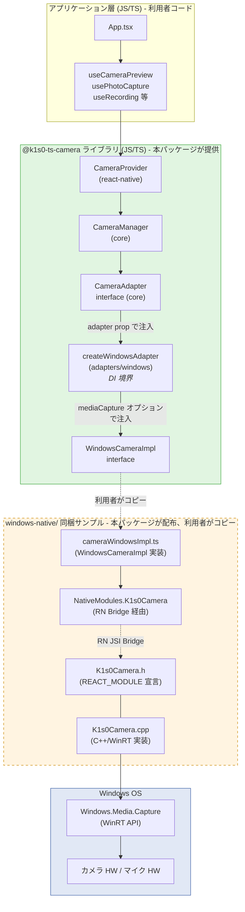
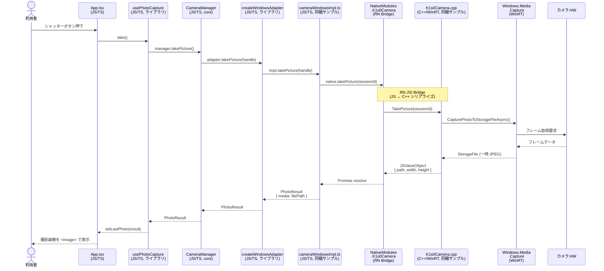
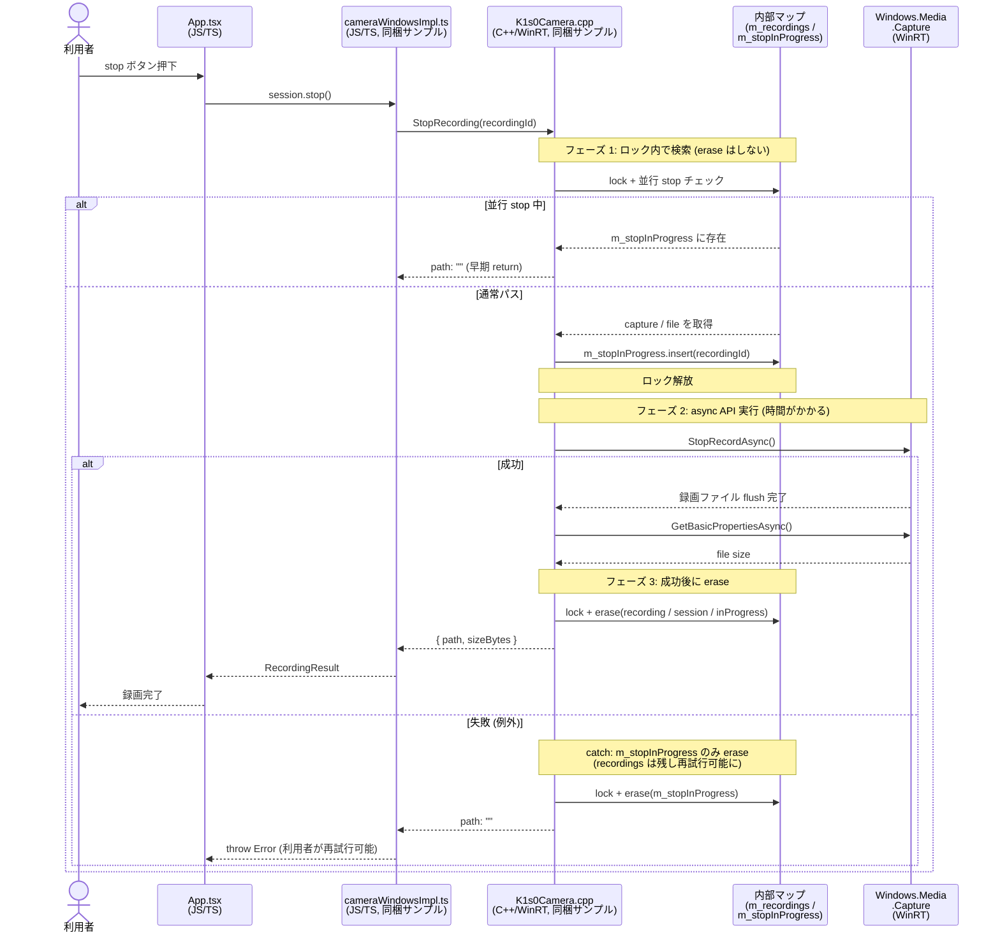

# @k1s0-ts-camera/react-native

`@k1s0-ts-camera/core` の **React Native バインディング** です。`CameraAdapter` の **prop 注入式** を採用し、iOS / Android / Windows いずれの実装でも切り替え可能です。

公式アダプタは別エントリで配布されます：

| エントリ | 対象 | 必要な peer |
|---|---|---|
| `@k1s0-ts-camera/react-native/adapters/vision` | iOS / Android (推奨) | `react-native-vision-camera ^4` |
| `@k1s0-ts-camera/react-native/adapters/expo` | iOS / Android (Expo) | `expo-camera ^15`, `expo-av ^14` |
| `@k1s0-ts-camera/react-native/adapters/windows` | Windows | `react-native-windows` + 同梱の C++/WinRT サンプルをコピー |

## 使用例 (vision-camera)

```tsx
import { CameraProvider, useCameraPreview } from "@k1s0-ts-camera/react-native";
import { createVisionCameraAdapter } from "@k1s0-ts-camera/react-native/adapters/vision";

const adapter = createVisionCameraAdapter();

export function App() {
  return (
    <CameraProvider adapter={adapter}>
      <Screen />
    </CameraProvider>
  );
}
```

## Capabilities & Controls

torch / zoom / tap focus / 能力情報取得を hook 経由で提供します。RN の各カメラライブラリは API が異なるため、adapter コンストラクタに `controls` を**注入**するパターンで統一しています。

### vision-camera の例（controls 注入）

```tsx
import { useMemo, useRef, useState } from "react";
import { View, type LayoutChangeEvent } from "react-native";
import { Camera, useCameraDevice } from "react-native-vision-camera";
import * as VisionLib from "react-native-vision-camera";
import { CameraProvider } from "@k1s0-ts-camera/react-native";
import { createVisionCameraAdapter } from "@k1s0-ts-camera/react-native/adapters/vision";

function App() {
  // <Camera> ref と props を React state で持つ
  const cameraRef = useRef<Camera>(null);
  const device = useCameraDevice("back");
  const [torch, setTorch] = useState<"on" | "off">("off");
  const [zoom, setZoom] = useState(1);
  // プレビュー View のサイズ（onLayout で取得し、focus の相対→絶対 px 変換に使う）
  const [layout, setLayout] = useState({ width: 0, height: 0 });
  // onLayout コールバック（再生成を抑止するため useCallback 推奨だが例では省略）
  const onCameraLayout = (e: LayoutChangeEvent) => {
    setLayout({ width: e.nativeEvent.layout.width, height: e.nativeEvent.layout.height });
  };

  // adapter に ref / device / controls を注入
  const adapter = useMemo(
    () =>
      createVisionCameraAdapter({
        library: VisionLib as never,
        cameraRef: () => cameraRef.current as never,
        device: () => device as never,
        controls: {
          // hook からの setTorch 呼び出し → React state へ流す → <Camera torch={...}> に反映
          setTorch: (mode) => setTorch(mode),
          setZoom: (z) => setZoom(z),
          // tap focus は vision-camera v4 の Camera.focus({x,y}) 経由
          // 重要: vision-camera は絶対 px を期待するため、core から渡る 0..1 相対座標を View サイズで変換する
          setFocus: (point) => {
            if (point !== undefined && layout.width > 0 && layout.height > 0) {
              cameraRef.current?.focus({
                x: point.x * layout.width,
                y: point.y * layout.height,
              });
            }
          },
        },
      }),
    // layout が更新されたら adapter を作り直す（最新値を closure に取り込むため）
    [device, layout],
  );

  return (
    <CameraProvider adapter={adapter}>
      <View onLayout={onCameraLayout} style={{ flex: 1 }}>
        {device && <Camera ref={cameraRef} device={device} torch={torch} zoom={zoom} isActive />}
      </View>
      <Controls />
    </CameraProvider>
  );
}
```

> **座標変換のポイント**: core が `setFocus({ x, y })` に渡す座標は `0..1` の相対値です。Web の `MediaTrackConstraints.pointsOfInterest` は spec 上相対座標を受け付けますが、vision-camera の `Camera.focus()` は absolute px を期待します。adapter 利用者は `onLayout` 等で View サイズを取得し、`controls.setFocus` 内で相対→絶対変換するか、絶対 px サポートが追加されるまで `point.x * width` で常時換算してください。

### hook 側（react / react-native 共通）

```tsx
import { useTorch, useZoom, useFocus, useCameraCapabilities } from "@k1s0-ts-camera/react-native";

function Controls() {
  const { capabilities } = useCameraCapabilities();
  const { mode, set: setTorch, supported: torchOk } = useTorch();
  const { zoom, set: setZoom, range, supported: zoomOk } = useZoom();
  const { focus, supported: focusOk } = useFocus();
  // ...同じ API で全プラットフォーム共通
}
```

### Capability マトリクス

| 機能 | Web | vision-camera | expo-camera | windows |
|------|-----|---------------|-------------|---------|
| torch | ✅ applyConstraints | controls.setTorch 注入 | controls.setTorch 注入 | impl.setTorch 必要 |
| zoom | ✅ (range 取得可) | device.min/maxZoom + controls 注入 | controls 注入（**0..1 の正規化値** ⚠️） | impl.setZoom 必要 |
| tap focus | ✅ (相対 0..1) | controls.setFocus 注入（要 相対→絶対 px 変換） | controls.setFocus 注入 | impl.setFocus 必要 |
| getCapabilities | ✅ MediaTrackCapabilities | device API + controls から推定 | controls から推定 | impl.getCapabilities 必要 |

未対応のときは `CameraControlError("UNSUPPORTED")` が投げられます。`useTorch().supported` 等で feature detection してから UI を出してください。`setFocus` の `point.x` / `point.y` は core が `0..1` 範囲外を `CameraControlError("OUT_OF_RANGE")` で reject します。

> **⚠️ expo-camera の zoom 仕様**: `<CameraView zoom={...}>` prop は**倍率ではなく `0..1` の正規化された値**です（`0` = 等倍、`1` = 最大ズーム）。vision-camera のように `device.maxZoom` 相当（例: 5 倍）の値を渡すと範囲外として無視されます。`useZoom()` から `set()` を呼ぶときは必ず `0..1` 範囲の値を渡してください。expoCameraAdapter の `getCapabilities` も `{ min: 0, max: 1, step: 0.01 }` を固定で返すため、`useZoom().range` を参考にスライダ UI を組むと自動的に正しい範囲になります。

## Backlog

- `focus` に絶対 px 座標オプション（現状は相対 0..1）
- `capability-change` / `torch-change` イベント
- vision-camera の Frame Processor を使った barcode scan 実装
- Windows MediaCapture の TorchControl / ZoomControl / FocusControl 同梱サンプル

---

## Windows 対応ガイド (C++/WinRT ネイティブモジュール実装)

`react-native-windows` には公式のカメラライブラリが存在しないため、`Windows.Media.Capture` を呼び出す **C++/WinRT ネイティブモジュール** を自前で追加する必要があります。

本パッケージには `windows-native/` ディレクトリに **コピーするだけで動く最小実装サンプル** を同梱しているため、利用者が C++ を新規に書く必要はありません（追記スニペットも同梱）。

> **動作確認は利用者環境で必須**：同梱サンプルは Visual Studio 2022 + Windows 10 SDK 22621 + react-native-windows 0.76 系で動作確認した最小実装です。SDK バージョンや RN-Windows のメジャー更新で API シグネチャが変わる可能性があります。

### アーキテクチャ概要

#### コンポーネント関係図

JS/TS 層 → RN Bridge → C++/WinRT → Windows OS の 4 階層構造です。本ライブラリ (`@k1s0-ts-camera/*`) は **TS 層と「Windows アダプタ DI 境界」までを提供** し、それより下（破線部分）は `windows-native/` 同梱サンプルを利用者プロジェクトにコピーして組み込みます。



| 階層 | 役割 | 提供元 |
|---|---|---|
| **アプリケーション層** | React コンポーネント、業務ロジック | 利用者 |
| **@k1s0-ts-camera ライブラリ** | 統一 API、状態管理、adapter DI 境界 | **本パッケージ** |
| **`windows-native/` 同梱サンプル** | TS ブリッジ + C++/WinRT NativeModule の **コピー元** | **本パッケージが配布**、利用者は自プロジェクトにコピー |
| **Windows OS** | WinRT カメラ API とハードウェア | Microsoft |

#### シーケンス図 (takePicture の呼び出しフロー例)

「撮影ボタン押下」が JS から C++ を経由して Windows OS のカメラハードウェアに届くまでの 1 往復を示します。



#### シーケンス図 (stopRecording の 3 フェーズ + race 防御)

`stopRecording` は **「ロック内で検索 → ロック解放して async API 実行 → 成功後にロック再取得して map から削除」** という 3 フェーズ構造です。これにより失敗時の再試行可能性と、並行呼び出しに対する安全性を両立しています。



**このフローのポイント**：
- フェーズ 2（`co_await`）の最中に同じ `recordingId` で再度 `StopRecording` が呼ばれても、`m_stopInProgress` のチェックで早期 return される（WinRT の同一 MediaCapture への重複 stop を防止）
- フェーズ 2 で例外が飛んだ場合、`m_recordings` は erase されず利用者は再試行可能。一方 `m_stopInProgress` は必ず erase されるため、再試行は通る
- フェーズ 3 まで到達したら成功確定。3 つの map から一度に削除

### 同梱ファイル一覧

`node_modules/@k1s0-ts-camera/react-native/windows-native/` 配下に以下を同梱しています：

| ファイル | 種別 | コピー先 | 役割 |
|---|---|---|---|
| `K1s0Camera.idl` | C++/WinRT | `windows/<AppName>/K1s0Camera.idl` | MIDL3 runtimeclass 宣言 |
| `K1s0Camera.h` | C++/WinRT | `windows/<AppName>/K1s0Camera.h` | NativeModule ヘッダ |
| `K1s0Camera.cpp` | C++/WinRT | `windows/<AppName>/K1s0Camera.cpp` | `Windows.Media.Capture` ラップ実装 |
| `cameraWindowsImpl.ts.template` | TypeScript | `src/cameraWindowsImpl.ts` （`.template` 削除して配置） | NativeModule を呼ぶ `WindowsCameraImpl` 実装 |
| `vcxproj.snippet.xml` | スニペット | `.vcxproj` に追記 | IDL / ヘッダ / 実装の `<ItemGroup>` |
| `ReactPackageProvider.cpp.snippet` | スニペット | `ReactPackageProvider.cpp` に追記 | `AddModule(L"K1s0Camera", ...)` の登録行 |
| `Package.appxmanifest.snippet.xml` | スニペット | `Package.appxmanifest` に追記 | webcam / microphone capability |
| `README.md` | ドキュメント | （参照のみ） | 詳細手順 |

詳細は [`windows-native/README.md`](./windows-native/README.md) を参照してください。

### Step 1: ファイルをコピー

PowerShell で以下を実行すると、必要なファイルが利用者プロジェクトの正しい場所にコピーされます（`<AppName>` と `<ProjectRoot>` は環境に合わせて読み替え）：

```powershell
# 変数定義（利用者プロジェクトのルートと Windows アプリ名）
$ProjectRoot = "C:\path\to\your\rn-windows-app"
$AppName = "MyApp"

# パッケージ配布元（node_modules 内、npm install 後に存在）
$Src = "$ProjectRoot\node_modules\@k1s0-ts-camera\react-native\windows-native"

# C++/WinRT ファイル群を windows/<AppName>/ にコピー
Copy-Item "$Src\K1s0Camera.idl" "$ProjectRoot\windows\$AppName\"
Copy-Item "$Src\K1s0Camera.h"   "$ProjectRoot\windows\$AppName\"
Copy-Item "$Src\K1s0Camera.cpp" "$ProjectRoot\windows\$AppName\"

# TypeScript ブリッジを src/ にコピー（.template を外して .ts にリネーム）
Copy-Item "$Src\cameraWindowsImpl.ts.template" "$ProjectRoot\src\cameraWindowsImpl.ts"
```

### Step 2: 3 ファイルにスニペットを追記（手動）

以下 3 ファイルへの追記のみ手動で行ってください。各スニペットファイルに具体的な追記内容が記載されています：

1. **`windows/<AppName>/<AppName>.vcxproj`** に `vcxproj.snippet.xml` の `<ItemGroup>` 3 つを追加
   - もしくは Visual Studio で「既存項目の追加」→ 上記 3 ファイルを選択
2. **`windows/<AppName>/ReactPackageProvider.cpp`** の `CreatePackage` 関数本体に `ReactPackageProvider.cpp.snippet` の 2 行（`#include` + `AddModule`）を追加
3. **`windows/<AppName>/Package.appxmanifest`** の `<Capabilities>` ブロックに `Package.appxmanifest.snippet.xml` の `<DeviceCapability>` 2 行を追加

### Step 3: アプリケーションで使う

```tsx
// app/src/App.tsx
import { CameraProvider } from "@k1s0-ts-camera/react-native";
import { createWindowsAdapter } from "@k1s0-ts-camera/react-native/adapters/windows";
// Step 1 でコピーした TypeScript ブリッジ
import { createWindowsNativeImpl } from "./cameraWindowsImpl";

// ネイティブモジュールを注入した adapter を生成
const adapter = createWindowsAdapter({
  mediaCapture: createWindowsNativeImpl(),
});

export function App() {
  return (
    <CameraProvider adapter={adapter}>
      <CameraScreen />
    </CameraProvider>
  );
}
```

### Step 3.5: blocked 時の「設定アプリへ」誘導（任意）

`@k1s0-ts-camera/core` の `attachNotificationBridge` に `openSettings` コールバックを渡すと、権限が `blocked` のときに「設定を開く」ボタン付き dialog が表示されます。Windows では `ms-settings:privacy-webcam` URI スキームで OS のカメラプライバシ設定を直接開けます。

```tsx
// app/src/openWindowsCameraSettings.ts
import { Linking } from "react-native";

// Windows のカメラプライバシ設定ページを開く
// ms-settings: は Windows 標準の Settings App 用 URI スキーム
export async function openWindowsCameraSettings(): Promise<void> {
  try {
    // Linking.openURL は react-native-windows でも対応している
    // react-native-windows 0.76 系の Launcher.LaunchUriAsync にマッピングされる
    await Linking.openURL("ms-settings:privacy-webcam");
  } catch {
    // 失敗時はフォールバックとして汎用プライバシ画面を試す
    await Linking.openURL("ms-settings:privacy");
  }
}
```

使い方：

```tsx
import { attachNotificationBridge } from "@k1s0-ts-camera/core";
import { openWindowsCameraSettings } from "./openWindowsCameraSettings";

// notification manager と camera manager を紐付ける際に openSettings を渡す
attachNotificationBridge(cameraManager, notificationManager, {
  openSettings: () => {
    void openWindowsCameraSettings();
  },
});
```

これにより、利用者が初回権限を拒否（=`blocked`）した後にカメラ操作を試みると、自動的に「設定を開く」ボタン付き dialog が表示され、ワンタップで OS 設定画面に飛べます。

### Step 4: ビルドと動作確認

```cmd
:: 通常通り run-windows
npx react-native run-windows --arch x64

:: または直接 msbuild
msbuild windows\<AppName>.sln /p:Configuration=Release /p:Platform=x64
```

初回起動時にカメラ権限のダイアログが Windows OS から表示されます。「許可」を選ぶと以降は granted として扱われます。

### 制限事項

- **バーコードスキャンは未実装**：同梱サンプルには含めていません。実装する場合は C++ 側で `MediaFrameReader` でフレームを取得し、[`ZXing.Net`](https://github.com/micjahn/ZXing.Net) や Microsoft の Vision API バインディングでデコードする処理を追加してください
- **ライブプレビュー UI は別途**：同梱サンプルは「静止画 / 動画キャプチャ」のみ。`<CaptureElement>` を XAML 側に置いて `MediaCapture` の `PreviewToCaptureElementAsync` で表示する場合は、`react-native-windows` の `ViewManager` を追加で書く必要があります
- **iOS/Android の vision-camera と同じレベルの機能網羅は望めません**：Windows 環境特有の機能（HDR、複数カメラ同時、ピンチズーム等）は別途実装が必要です
- **MSIX / UWP context が前提**：`ApplicationData::Current().TemporaryFolder()` を使うため、unpacked dev ビルドでは fallback 挙動が起きる可能性あり。本番は MSIX 配布を推奨（詳細は [`windows-native/README.md`](./windows-native/README.md) の前提条件セクション参照）
- **C++20 必須 / SDK 22621 推奨**：`co_await` / `co_return` 使用のため `.vcxproj` で `<LanguageStandard>stdcpp20</LanguageStandard>` が必要。Windows 10 SDK は 22621 以降を推奨（22000 以前では `MediaEncodingProfile::CreateMp4` 等のシグネチャ差異あり）
- **pch.h の前提**：`pch.h` に `<winrt/Windows.Foundation.h>` 等の基本 WinRT ヘッダが取り込まれている前提（react-native-windows テンプレートの既定 pch.h なら満たされる）
- **SDK バージョン依存**：Windows 10 SDK 22621 / react-native-windows 0.76 系で確認。それ以前 / 以降のバージョンでは API シグネチャ変更がある可能性があります
- **解像度は固定返却**：`takePicture` の戻り値 `width` / `height` はサンプルでは 1920×1080 固定。厳密値が必要なら `VideoController.GetMediaStreamProperties()` を C++ で追加してください

---

## ライセンス

UNLICENSED (社内利用)
