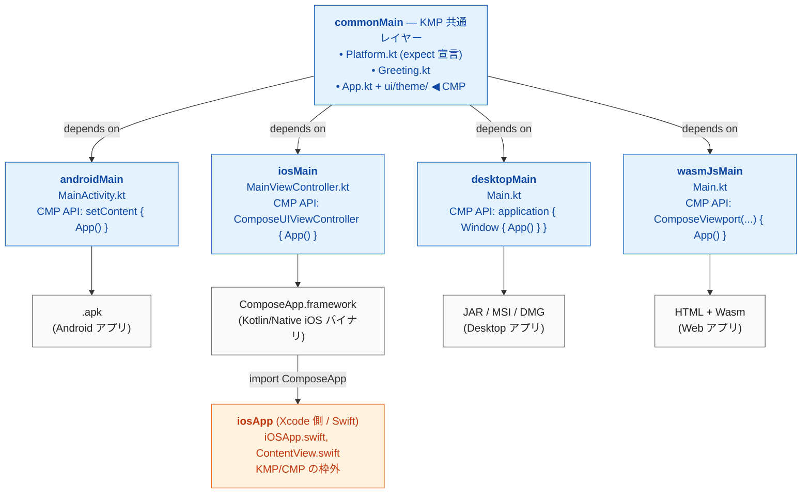

# KMP + CMP スキャフォールド

Kotlin Multiplatform (KMP) と Compose Multiplatform (CMP) を組み合わせた
クロスプラットフォーム アプリ開発の出発点となるテンプレート。

**対応ターゲット:**

| プラットフォーム | エントリポイント                          | 実行コマンド                                                 |
| ---------------- | ----------------------------------------- | ------------------------------------------------------------ |
| Android          | `composeApp/src/androidMain` (MainActivity) | `./gradlew :composeApp:installDebug`                         |
| iOS              | `iosApp/`                                 | Xcode で `iosApp.xcodeproj` を開いて Run                     |
| Desktop (JVM)    | `composeApp/src/desktopMain` (Main.kt)    | `./gradlew :composeApp:run`                                  |
| Web (Wasm)       | `composeApp/src/wasmJsMain` (Main.kt)     | `./gradlew :composeApp:wasmJsBrowserDevelopmentRun`          |

---

## 0. KMP と CMP のちがい (初学者向け)

**ひとことで:**

| 略称 | 正式名称                   | 役割                                                                 | 誰がつくっている        |
| ---- | -------------------------- | -------------------------------------------------------------------- | ----------------------- |
| KMP  | **K**otlin **M**ulti**P**latform | Kotlin の**コード**を Android / iOS / Desktop / Web で**共有する仕組み** | Kotlin 言語チーム (JetBrains) |
| CMP  | **C**ompose **M**ulti**P**latform | **UI** を全 OS で共有する**ライブラリ** (KMP の上に乗る)              | Compose チーム (JetBrains)   |

> CMP は KMP に依存している。
> KMP は「コード共有のための土台」、CMP は「KMP の土台の上に建つ UI 専用フレームワーク」と覚えると分かりやすい。
> KMP だけでも (CMP を使わなくても) ロジックだけ共有して UI は各 OS のネイティブで作る選択肢もある。

### 0.1 本スキャフォールドの中で「どこが KMP / どこが CMP か」

#### KMP に属するもの (= 共有コードの基盤)

| 種別             | 場所                                                                                                 |
| ---------------- | ---------------------------------------------------------------------------------------------------- |
| Gradle プラグイン | `composeApp/build.gradle.kts` の `alias(libs.plugins.kotlinMultiplatform)`                          |
| ソースセット階層 | `composeApp/src/commonMain` / `androidMain` / `iosMain` / `desktopMain` / `wasmJsMain` の**フォルダ構造そのもの** |
| ターゲット宣言   | `kotlin { androidTarget() / iosX64() / iosArm64() / iosSimulatorArm64() / jvm("desktop") / wasmJs() }` |
| 言語機能         | `expect fun currentPlatform()` (`Platform.kt`) と各 OS の `actual` 実装                              |
| 共有ロジック     | `Greeting.kt`、`Platform.kt` の `data class Platform` (← UI でも CMP でもない純粋な Kotlin)         |
| iOS バイナリ     | `iosTarget.binaries.framework { baseName = "ComposeApp" }` (Kotlin/Native で `.framework` 出力)     |

#### CMP に属するもの (= UI 専用)

| 種別             | 場所                                                                                                 |
| ---------------- | ---------------------------------------------------------------------------------------------------- |
| Gradle プラグイン | `alias(libs.plugins.composeMultiplatform)` + `alias(libs.plugins.composeCompiler)`                  |
| ランタイム依存   | `compose.runtime` / `compose.foundation` / `compose.material3` / `compose.ui` / `compose.components.resources` |
| 共通 UI          | `App.kt` の `@Composable fun App()`、`ui/theme/` 配下 (Color/Theme/Type)                              |
| 各 OS の埋め込み API | Android: `setContent { App() }`, iOS: `ComposeUIViewController { App() }`,<br>Desktop: `Window { App() }`, Web: `ComposeViewport(...) { App() }` |
| Desktop パッケージ | `compose.desktop { application { nativeDistributions { ... } } }`                                   |
| Web 有効化フラグ | `gradle.properties` の `org.jetbrains.compose.experimental.wasm.enabled=true`                       |

### 0.2 境界線にあるファイル (両方を使う橋渡し役)

各プラットフォームのエントリポイントは「KMP のソースセットに置かれた Kotlin コードが CMP の API を呼ぶ」構造になっている。

| ファイル                                          | KMP 的な側面                                | CMP 的な側面                          |
| ------------------------------------------------- | ------------------------------------------- | ------------------------------------- |
| `androidMain/.../MainActivity.kt`                 | androidMain ソースセットに属する Kotlin     | `setContent { App() }` (CMP)          |
| `iosMain/.../MainViewController.kt`               | iosMain ソースセット、UIKit を import       | `ComposeUIViewController { App() }` (CMP) |
| `desktopMain/.../Main.kt`                         | desktopMain ソースセット、`fun main()`      | `application { Window { App() } }` (CMP) |
| `wasmJsMain/.../Main.kt`                          | wasmJsMain ソースセット、ブラウザ DOM 操作  | `ComposeViewport(rootElement) { App() }` (CMP) |
| `iosApp/iosApp/ContentView.swift`                 | KMP が出力した `ComposeApp.framework` を import | `MainViewControllerKt.MainViewController()` 経由で Compose UI 表示 |

### 0.3 純粋な KMP / 純粋な CMP / Kotlin でも KMP でもないもの

| カテゴリ                  | 例                                                                                       |
| ------------------------- | ---------------------------------------------------------------------------------------- |
| **純粋な KMP** (UI 非依存) | `Greeting.kt` (commonMain) / `Platform.kt` の `data class` と `expect/actual` 関数        |
| **純粋な CMP** (UI 限定)  | `App.kt` の `@Composable`、`ui/theme/Color.kt` `Theme.kt` `Type.kt`                       |
| **KMP でも CMP でもない** | `iosApp/iosApp/iOSApp.swift` `ContentView.swift` `Info.plist` `Config.xcconfig` (= Xcode / Swift / Apple 標準) |
| **Android プラットフォーム** | `AndroidManifest.xml`、`res/values/strings.xml` (Android SDK 由来、KMP の枠外)            |

> ヒント: もし**ロジックだけ共有して UI は各 OS ネイティブで作りたい**場合、
> CMP プラグイン・`compose.*` 依存・`App.kt` `ui/theme/` を全て削除しても KMP プロジェクトとしては成立する。
> その場合、androidMain は Jetpack Compose / View で、iosMain は SwiftUI / UIKit でそれぞれ UI を実装することになる。

### 0.4 一目で分かる依存関係図



> 凡例:
> - 🟦 青背景: KMP のソースセット (内部で CMP API を呼んでいる)
> - ⬜ グレー背景: 各 OS のビルド成果物
> - 🟧 オレンジ背景: KMP/CMP の枠外 (Swift / Xcode)

---

## 1. ディレクトリ構成

```
kmp/
├── build.gradle.kts                 # ルートビルドスクリプト
├── settings.gradle.kts              # サブモジュール宣言・リポジトリ
├── gradle.properties                # JVM/Kotlin/Android 等のグローバル設定
├── gradle/
│   ├── libs.versions.toml           # バージョンカタログ (依存ライブラリ集約)
│   └── wrapper/
│       └── gradle-wrapper.properties
├── gradlew / gradlew.bat            # Gradle Wrapper 起動スクリプト
│
├── composeApp/                      # ★ メインモジュール (全 OS の UI/ロジック)
│   ├── build.gradle.kts
│   └── src/
│       ├── commonMain/              # 共通コード (App, Greeting, テーマ, expect 宣言)
│       │   └── kotlin/com/example/kmpapp/
│       ├── androidMain/             # Android 固有 (MainActivity, AndroidManifest)
│       ├── iosMain/                 # iOS 固有 (MainViewController, Platform.ios)
│       ├── desktopMain/             # Desktop 固有 (Main.kt, Platform.desktop)
│       └── wasmJsMain/              # Web 固有 (Main.kt, index.html, Platform.wasmJs)
│
└── iosApp/                          # iOS の Xcode プロジェクト配置先
    ├── iosApp/
    │   ├── iOSApp.swift
    │   ├── ContentView.swift
    │   └── Info.plist
    ├── Configuration/Config.xcconfig
    └── README.md                    # Xcode プロジェクト生成手順
```

---

## 2. 前提環境

| ツール                 | 推奨バージョン       | 用途                                        |
| ---------------------- | -------------------- | ------------------------------------------- |
| JDK                    | 17 以上              | Gradle / Kotlin / AGP                       |
| Android Studio         | Koala (2024.1.x) 以上 | Android 開発                                |
| Xcode                  | 15 以上              | iOS 開発 (macOS 限定)                       |
| Node.js (任意)         | 18+ LTS              | wasmJs ターゲットの Webpack キャッシュで使用 |

---

## 3. 初回セットアップ

### 3.1 Gradle Wrapper の `.jar` を生成する

本リポジトリには `gradle-wrapper.jar` を含めていないため、初回のみ手動で生成する。

```bash
# システムにインストール済みの Gradle で wrapper jar を生成
gradle wrapper --gradle-version 8.11.1 --distribution-type bin
```

> Gradle 本体が無い場合は [Gradle 公式](https://gradle.org/install/) からインストールするか、
> Android Studio / IntelliJ で本ディレクトリを開いて IDE に同期させると自動で生成される。

### 3.2 Android SDK のパス設定

`local.properties` を作成し、Android SDK の場所を指定する (`.gitignore` 対象)。

```properties
sdk.dir=C:\\Users\\<USERNAME>\\AppData\\Local\\Android\\Sdk
```

### 3.3 IDE で開く

- Android Studio (推奨): `Open` でルートディレクトリを選択し、Gradle 同期完了まで待機
- IntelliJ IDEA Ultimate でも可

---

## 4. 各プラットフォームの実行

### 4.1 Android (エミュレータ or 実機)

```bash
# デバッグビルドをインストール (要・エミュレータ起動 or 実機接続)
./gradlew :composeApp:installDebug

# ランチャーから "KMP Scaffold" を起動
```

または Android Studio の Run ボタンから `composeApp` 構成で実行。

### 4.2 iOS

`iosApp/README.md` を参照し、Xcode プロジェクト (`iosApp.xcodeproj`) を生成する。
生成後は Xcode 上で **Run** ボタン (⌘R) で起動。

シミュレータ向けのフレームワーク埋め込みは、Build Phase に追加された次のスクリプトが担う:

```sh
cd "$SRCROOT/.."
./gradlew :composeApp:embedAndSignAppleFrameworkForXcode
```

### 4.3 Desktop (Windows / macOS / Linux)

```bash
# 開発実行 (高速起動)
./gradlew :composeApp:run

# OS ネイティブインストーラを生成 (Win: .msi, macOS: .dmg, Linux: .deb)
./gradlew :composeApp:packageDistributionForCurrentOS
```

### 4.4 Web (Wasm/JS)

```bash
# 開発サーバを起動 (デフォルト: http://localhost:8080)
./gradlew :composeApp:wasmJsBrowserDevelopmentRun

# 本番配信用 (composeApp/build/dist/wasmJs/productionExecutable/ に出力)
./gradlew :composeApp:wasmJsBrowserDistribution
```

> Wasm 版は Chromium / Firefox 最新版で動作確認推奨。Safari は WebAssembly GC 対応が遅れている。

---

## 5. パッケージ名・アプリ名の変更

新規プロジェクトとして使う場合、置換すべきプレースホルダ:

| 種別                  | 現在の値                       | 置換先候補例               |
| --------------------- | ------------------------------ | -------------------------- |
| パッケージ            | `com.example.kmpapp`           | `jp.example.myapp`         |
| Android `applicationId` | `com.example.kmpapp`         | 同上                       |
| iOS Bundle ID         | `com.example.kmpapp`           | 同上 (Config.xcconfig)     |
| アプリ名 (Android)    | `KMP Scaffold`                 | `res/values/strings.xml`   |
| アプリ名 (Desktop)    | `kmp-scaffold` / `KMP Scaffold` | `composeApp/build.gradle.kts` `compose.desktop.application` |
| Window タイトル       | `KMP Scaffold`                 | `desktopMain/Main.kt`, `wasmJsMain/resources/index.html` |
| ルートプロジェクト名  | `kmp-scaffold`                 | `settings.gradle.kts`      |

VS Code / IntelliJ の「ファイル内全置換」で一括変更してから、各ディレクトリ名も追従させること。

---

## 6. ソースセット階層

KMP の階層化ソースセット (Hierarchical Source Sets):

```
commonMain
 ├── androidMain
 ├── desktopMain
 ├── wasmJsMain
 └── iosMain         (中間ソースセット)
      ├── iosX64Main
      ├── iosArm64Main
      └── iosSimulatorArm64Main
```

- `commonMain` に書いたコードは全 OS から参照可能
- `iosMain` に書いたコードは iOS 3 ターゲット全てから参照可能 (UIKit などを利用)
- `expect`/`actual` ペアで OS 依存実装を差し替える (例: `Platform.kt`)

---

## 7. よくあるトラブル

| 症状                                              | 原因と対処                                                                 |
| ------------------------------------------------- | -------------------------------------------------------------------------- |
| `Unsupported Kotlin version` で同期失敗            | `gradle/libs.versions.toml` の `kotlin` と Android Studio バージョンを合わせる |
| `Cannot find Wasm runner` のような Wasm エラー    | `gradle.properties` の `org.jetbrains.compose.experimental.wasm.enabled=true` を確認 |
| iOS ビルドで `ComposeApp.framework not found`     | Xcode の Framework Search Paths と Run Script 設定を `iosApp/README.md` どおり再設定 |
| Android のメソッド数超過 (multiDex 警告)          | `composeApp/build.gradle.kts` の `defaultConfig` に `multiDexEnabled = true` を追加 |

---

## 8. ライセンス

本スキャフォールドはテンプレート用途。利用先プロジェクトのライセンスに従って改変・配布すること。
